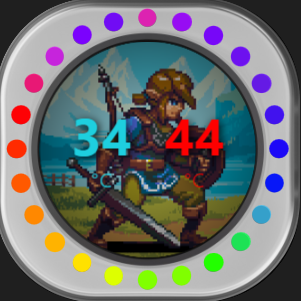

# 🖥️ Face Customizada para LCD Corsair iCUE (Split Media Sensor)

Um layout elegante e customizável para telas LCD de Water Coolers da Corsair via iCUE. Ele exibe dois sensores simultâneos com suporte a imagens de fundo customizadas e efeitos de desfoque.

## 📸 Preview

## ✨ Funcionalidades

* **Monitoramento Duplo:** Exibe dois sensores (esquerdo e direito) lado a lado (ex: Temperatura da CPU e GPU).
* **Fundo Customizável:** Suporte para imagens de fundo (PNG, JPG, GIF) configuráveis direto no painel do iCUE.
* **Modo Blur (Desfoque):** Opção (liga/desliga) para desfocar e escurecer levemente a imagem de fundo, dando total destaque aos números.
* **Cores Independentes:** Escolha a cor do texto para cada sensor individualmente direto pelo iCUE.
* **Design Premium:** Tipografia moderna (estilo Dashboard), tamanhos dinâmicos e sombras (`text-shadow`) para garantir leitura perfeita independentemente da imagem de fundo.

## 🚀 Como Instalar e Usar

1. Baixe os arquivos do layout.
2. Dê 2 cliques para abrir a interface de importação do iCUE
3. Abra o software **Corsair iCUE**.
4. Clique no seu Water Cooler (LCD) e vá na aba de configuração da tela.
5. Escolha esta nova interface na lista.
6. Use o menu do iCUE para configurar:
   * A imagem de fundo desejada.
   * Ativar/Desativar o desfoque de fundo.
   * Quais sensores serão exibidos na Esquerda e Direita (ex: *Liquid Temp* e *CPU Temp*).
   * As cores de cada lado.

## 🛠️ Estrutura e Tecnologias

* **HTML5 e CSS3:** Para a estrutura e design responsivo (adaptável à resolução circular ou quadrada da bomba).
* **JavaScript:** Para a lógica de carregamento dos sensores.
* Integração com as APIs nativas do software (`IcueWidgetApiWrapper` e `SimpleSensorApiWrapper`).

---
*Desenvolvido para deixar o seu setup ainda mais incrível!*